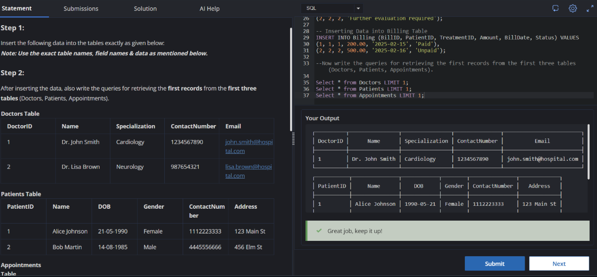

# Experiment 1

Name: Tarun Sharma

UID: 24BCS10081

## Aim

To insert the given records into the hospital database tables and retrieve the first record from the first three tables.

## Question

Step 1:
Insert the following data into the tables exactly as provided below.
Note: Use the exact table names, field names, and data specified.

Step 2:
After inserting the data, write queries to retrieve the first records from the first three tables:
Doctors, Patients, and Appointments.

### Doctors Table

| DoctorID | Name           | Specialization | ContactNumber | Email                   |
|----------|----------------|----------------|---------------|-------------------------|
| 1        | Dr. John Smith | Cardiology     | 1234567890    | john.smith@hospital.com |
| 2        | Dr. Lisa Brown | Neurology      | 0987654321    | lisa.brown@hospital.com |

### Patients Table

| PatientID | Name          | DOB        | Gender | ContactNumber | Address     |
|-----------|---------------|------------|--------|---------------|-------------|
| 1         | Alice Johnson | 1990-05-21 | Female | 1112223333    | 123 Main St |
| 2         | Bob Martin    | 1985-08-14 | Male   | 4445556666    | 456 Elm St  |

### Appointments Table

| AppointmentID | PatientID | DoctorID | AppointmentDate | Status    |
|---------------|-----------|----------|-----------------|-----------|
| 1             | 1         | 1        | 2025-02-15      | Scheduled |
| 2             | 2         | 2        | 2025-02-16      | Completed |

### Treatments Table

| TreatmentID | PatientID | DoctorID | Diagnosis    | TreatmentDescription      | TreatmentDate |
|-------------|-----------|----------|--------------|---------------------------|---------------|
| 1           | 1         | 1        | Hypertension | Prescribed medication     | 2025-02-15    |
| 2           | 2         | 2        | Migraine     | MRI Scan and medications  | 2025-02-16    |

### MedicalRecords Table

| RecordID | PatientID | TreatmentID | Notes                                |
|----------|-----------|-------------|--------------------------------------|
| 1        | 1         | 1           | Patient responding well to treatment |
| 2        | 2         | 2           | Further evaluation required          |

### Billing Table

| BillID | PatientID | TreatmentID | Amount | BillDate    | Status |
|--------|-----------|-------------|--------|-------------|--------|
| 1      | 1         | 1           | 200.00 | 2025-02-15  | Paid   |
| 2      | 2         | 2           | 500.00 | 2025-02-16  | Unpaid |

## SQL Queries Used

### Insert into Doctors

```sql
INSERT INTO Doctors (DoctorID, Name, Specialization, ContactNumber, Email) VALUES
(1, 'Dr. John Smith', 'Cardiology', '1234567890', 'john.smith@hospital.com'),
(2, 'Dr. Lisa Brown', 'Neurology', '0987654321', 'lisa.brown@hospital.com');
```

### Insert into Patients

```sql
INSERT INTO Patients (PatientID, Name, DOB, Gender, ContactNumber, Address) VALUES
(1, 'Alice Johnson', '1990-05-21', 'Female', '1112223333', '123 Main St'),
(2, 'Bob Martin', '1985-08-14', 'Male', '4445556666', '456 Elm St');
```

### Insert into Appointments

```sql
INSERT INTO Appointments (AppointmentID, PatientID, DoctorID, AppointmentDate, Status) VALUES
(1, 1, 1, '2025-02-15', 'Scheduled'),
(2, 2, 2, '2025-02-16', 'Completed');
```

### Insert into Treatments

```sql
INSERT INTO Treatments (TreatmentID, PatientID, DoctorID, Diagnosis, TreatmentDescription, TreatmentDate) VALUES
(1, 1, 1, 'Hypertension', 'Prescribed medication', '2025-02-15'),
(2, 2, 2, 'Migraine', 'MRI Scan and medications', '2025-02-16');
```

### Insert into MedicalRecords

```sql
INSERT INTO MedicalRecords (RecordID, PatientID, TreatmentID, Notes) VALUES
(1, 1, 1, 'Patient responding well to treatment'),
(2, 2, 2, 'Further evaluation required');
```

### Insert into Billing

```sql
INSERT INTO Billing (BillID, PatientID, TreatmentID, Amount, BillDate, Status) VALUES
(1, 1, 1, 200.00, '2025-02-15', 'Paid'),
(2, 2, 2, 500.00, '2025-02-16', 'Unpaid');
```

### Retrieve First Record from Doctors

```sql
SELECT * FROM Doctors WHERE DoctorID = 1;
```

### Retrieve First Record from Patients

```sql
SELECT * FROM Patients WHERE PatientID = 1;
```

### Retrieve First Record from Appointments

```sql
SELECT * FROM Appointments WHERE AppointmentID = 1;
```

## Output

```text
┌──────────┬────────────────┬────────────────┬───────────────┬─────────────────────────┐
│ DoctorID │      Name      │ Specialization │ ContactNumber │          Email          │
├──────────┼────────────────┼────────────────┼───────────────┼─────────────────────────┤
│ 1        │ Dr. John Smith │ Cardiology     │ 1234567890    │ john.smith@hospital.com │
└──────────┴────────────────┴────────────────┴───────────────┴─────────────────────────┘

┌───────────┬───────────────┬────────────┬────────┬───────────────┬─────────────┐
│ PatientID │     Name      │    DOB     │ Gender │ ContactNumber │   Address   │
├───────────┼───────────────┼────────────┼────────┼───────────────┼─────────────┤
│ 1         │ Alice Johnson │ 1990-05-21 │ Female │ 1112223333    │ 123 Main St │
└───────────┴───────────────┴────────────┴────────┴───────────────┴─────────────┘

┌───────────────┬───────────┬──────────┬─────────────────┬───────────┐
│ AppointmentID │ PatientID │ DoctorID │ AppointmentDate │  Status   │
├───────────────┼───────────┼──────────┼─────────────────┼───────────┤
│ 1             │ 1         │ 1        │ 2025-02-15      │ Scheduled │
└───────────────┴───────────┴──────────┴─────────────────┴───────────┘

The output confirms that the queries were executed successfully.
```

## Output Screenshot



## Image Explanation

The screenshot shows the SQL editor with insertion queries executed for all six tables. It also includes the retrieval queries for the first records from Doctors, Patients, and Appointments. The output panel confirms that the first doctor record was returned successfully, showing that the insert and select operations worked as expected.

## Result

The required data was inserted into all specified tables, and the first records from Doctors, Patients, and Appointments were retrieved successfully.
